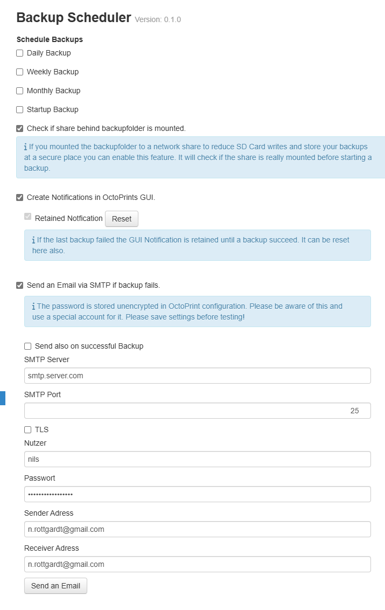

# Backup Scheduler

This plugin allows you to schedule OctoPrint backups at regular configured intervals. If a print is on going at the time of initializing the backup  the backup will be delayed until the ongoing print is completed, cancelled, or fails.

**WARNING**: This plugin currently does not monitor your disk usage in any way.

**NOTE**: The time settings are based on the device's local time that OctoPrint is running on. For octopi users use `sudo raspi-config` to set your time and appropriate timezone.

## Setup

Install via the bundled [Plugin Manager](https://docs.octoprint.org/en/master/bundledplugins/pluginmanager.html)
or manually using this URL:

    https://github.com/jneilliii/OctoPrint-BackupScheduler/archive/master.zip

Why is there a feature to check a mount? The problem is that flash memory segments wear out after a fairly low number of erase cycles, and the SD card’s wear-leveling algorithm will eventually cordon off enough of the card to cause file system issues. As the backup plugin writes repeatingly to the SD card and also all backups are also lost if the SD card is broken it is important to offload the backup to e.g. a NAS. With a NFS mount the backups are directly written to a share, avoiding both issues in one step.

The backup folder is located on OctoPrints base directory/data/backup.

```
pi@octopi:~/.octoprint/data/backup $ ls
octoprint-weekly-20240903-050053.zip  octoprint-weekly-20240910-050059.zip
```

[How to mount a NFS share.](https://www.google.de/search?q=mount+a+NFS+share+in+raspian)

## Settings




## Get Help

If you experience issues with this plugin or need assistance please use the issue tracker by clicking issues above.

## Additional Plugins

Check out my other plugins [here](https://plugins.octoprint.org/by_author/#jneilliii)

## Sponsors
- Andreas Lindermayr
- [@TheTuxKeeper](https://github.com/thetuxkeeper)
- [@tideline3d](https://github.com/tideline3d/)
- [SimplyPrint](https://simplyprint.io/)
- [Andrew Beeman](https://github.com/Kiendeleo)
- [Calanish](https://github.com/calanish)
- [Lachlan Bell](https://lachy.io/)
- [Jonny Bergdahl](https://github.com/bergdahl)
## Support My Efforts
I, jneilliii, programmed this plugin for fun and do my best effort to support those that have issues with it, please return the favor and leave me a tip or become a Patron if you find this plugin helpful and want me to continue future development.

[](https://www.patreon.com/jneilliii) [](https://paypal.me/jneilliii)

<small>No paypal.me? Send funds via PayPal to jneilliii&#64;gmail&#46;com

You can use [this](https://www.paypal.com/cgi-bin/webscr?cmd=_xclick&business=jneilliii@gmail.com) link too. But the normal PayPal fee will be deducted.
</small>